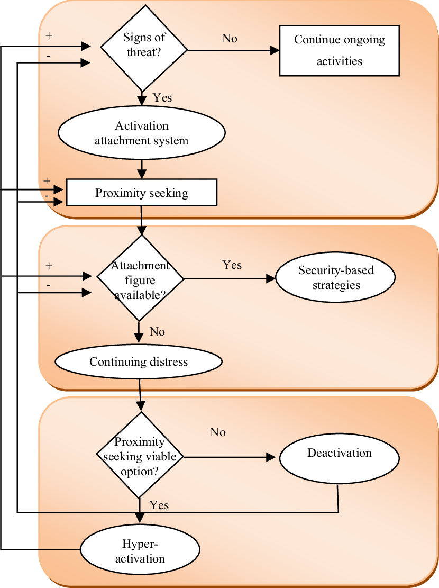
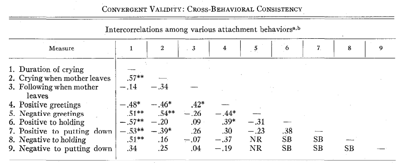
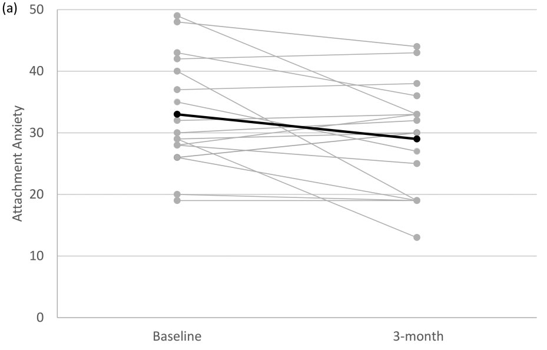
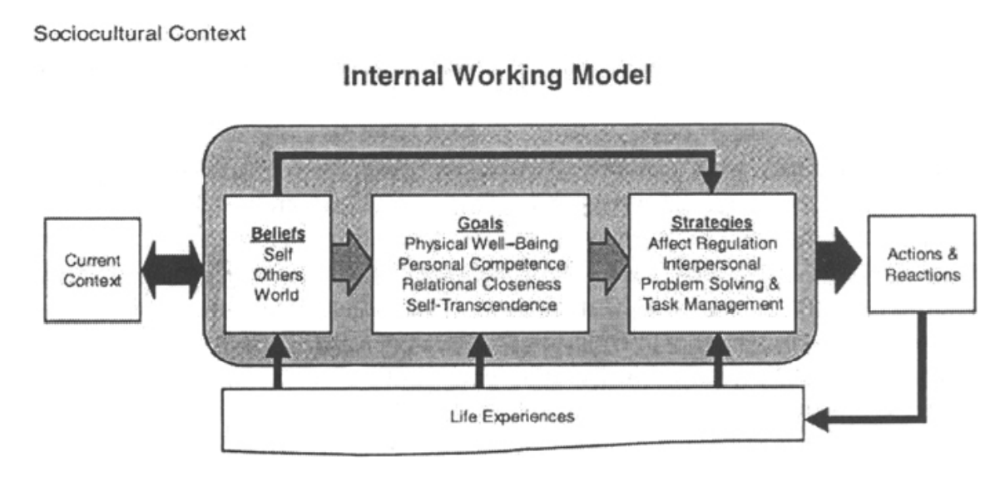

```{r setup, include=FALSE}
options(htmltools.dir.version = FALSE)
library(kableExtra)
knitr::opts_chunk$set(
  cache = FALSE,
  echo = FALSE,
  message = FALSE, 
  warning = FALSE,
  hiline = TRUE
)
```

```{r xaringan-themer, include=FALSE, warning=FALSE}
library(xaringanthemer)
style_duo_accent(
  primary_color = "#1381B0",
  secondary_color = "#FF961C",
  inverse_header_color = "#FFFFFF",
  inverse_background_color = "#4c516d", 
  colors = c(red = "#ff0019", black = "#000000"), inverse_text_color = "#FFFFFF"
)

library(xaringanExtra)
use_tile_view()
```

class: center, middle
background-image: url(https://www.amscins.com/wp-content/uploads/2011/05/Stockholm-university.jpg)
background-size: 125px
background-position: 5% 92%


## To What Extent are Attachment Styles Malleable: Attachment as Dispositional Traits or Contextual States?

#### Assignment two

**PSMT63: Human Development: Attachment and Relational Contexts of Lifespan Development**

Jon Ingi Hlynsson

#### Department of Psychology, Stockholm University


---


.middle[.center[
# Attachment Strategies ]]

.pull-left[
Attachment security is the **primary strategy** of the attachment system:  
- associated with preferable life outcomes


40% of people are insecurely attached


]


.pull-right[
```{r, out.width="65%", fig.align='right'}

```

<div style="text-align:right;">Bosmans (2009)</div>

]

???
As the primary attachment strategy, security is predictive of meaningful life outcomes such as **positive development of executive functioning**, **task-persistence** in problem solving, **effortful control**, **social competence**, **emotional understanding**, and **emotion regulation**. Consequently, *attachment security is preferable* (cf. primary strategy), and although secure attachments are the most common, approximately **40% of the population is insecurely attached**. 

---


.middle[.center[
# Attachment Strategies ]]

.pull-left[
Attachment security is the **primary strategy** of the attachment system:  
- associated with preferable life outcomes


40% of people are insecurely attached

*Are attachment styles malleable context-dependent states or immutable implicit-dispositional traits?*

]


.pull-right[
```{r, out.width="65%", fig.align='right'}

```
]

<div style="text-align:right;">Bosmans (2009)</div>
---


.middle[.center[# Attachment as an Organizational Construct]]


.pull-left[
Distinction between specific behaviours and patterns of behaviour:  
- if separation protest did index amount of attachment, infants' attachment would decrease as they develop from 12- and 24-months 


<br>

Attachment behaviours are predictably influenced by the context in which they occur as opposed to reliably referring to an indexable trait-like constant across situations

]

.pull-right[
```{r, fig.align='right'}

```

<div style="text-align:right;">Masters & Wellman (1974)</div>
]


???
If attachment is viewed as an implicit trait (i.e., an internal phenomenon that resides in some amount within individuals), index behaviours of attachment should intercorrelate 


Stability in attachment classifications (i.e., **organized patterns of behaviour**) is the rule rather than the exception (Waters et al., 2000), but specific behaviours occurring in one context might poorly predict itself in another context

A specific attachment behaviour in context A might be a better predictor of a phenotypically different behaviour in context B then of itself. For example, proximity seeking behaviour in a distressful situation might be more predictive of positively welcoming a primary caregiver upon reunion than it is of proximity seeking in distressful situations.

---

.middle[.center[
# Attachment Malleability ]]


.pull-left[
General continuity but lawful discontinuity

Although stability is the rule, **negative life events** predict instability in attachment classifications


Psychotherapeutic interventions facilitate attachment security


A psilocybin-assisted psychotherapeutic intervention reduced attachment-anxiety  

]


.pull-right[
```{r, fig.align='right'}

```

<div style="text-align:right;">Stauffer et al. (2021)</div>
]

???
attachment anxiety is associated with the worst outcomes in treatment


---


.middle[.center[
# Attachment as a State or Trait?]]


.pull-left[
Attachment as an organizational construct ≈ IWMs:  
- first socially learned experience 
- relatively stable (trait-like)


State attachment **and** trait attachment:  
- state attachment more contextually dependent 
- less variation in state attachment among securely attached individuals
- state attachment variability associated with psychological problems 
- security priming increases state attachment anxiety


]


.pull-right[

```{r, fig.align='right'}

```

<div style="text-align:right;">Griffith (2004)</div>
]

???
social learning is the functional goal of the attachment system beyond protection


---


.middle[.center[
# Conclusion]]

A dichotomization of attachment as either a trait or a state is non-pragmatic and arguably wrong  

--

Attachment classifications can change over time  

--
- Thus, **not an unmalleable dispositional trait**

--

Through IWM, humans can heuristically process novelty  

--
- Thus, **not a uniformly context dependent state**

--

Attachment is **both** a malleable trait and a contextually dependent state


---
class: inverse center middle

.middle[.center[
# Questions?]]

--
## Thank you for your attention!